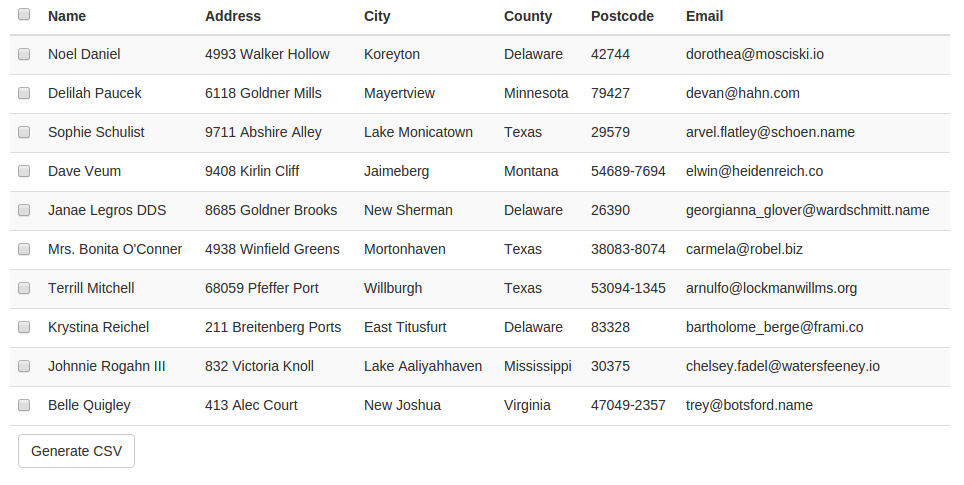

### Background of the Problem



We are generating a CSV of orders for the vendor which at the moment isn't a big problem as we do not have many vendors, or many orders, so the CSV will generate relatively quickly.   However, we know that as suppliers and orders are bound to increase, we need to find a better solution to generate larger files without blocking our precious ruby processes.

```ruby
class OrdersController < ApplicationController
  #...

  def download_csv
    orders = Order.where(id: order_ids)

    file = Tempfile.new

    CSV.open(file, "wb") do |csv|
      csv << ["Name", "Address", "City", "County", "Postcode", "Email"]
      orders.each do |order|
        csv << [order.name, order.address, order.city, order.county, order.postcode, order.email]
      end
    end

    send_file File.open(file.path)
  end
end
```

Obviously, this is where workers come in to do all the heavy lifting. By putting this work in a background process so that we can free up our ruby processes again.

```ruby
class OrdersController < ApplicationController
  #...

  def download_csv
    GenerateCSVJob.perform_async(params[:order_ids])

    # Code to send file back to user
  end
end
```

However, how can I tell my controller that the file has finished being generated and send it back to the user?

### The Implementation

It's at this point where we need to do some polling, and the purpose of this article.  I myself often forget how to do all the ajax trickery in Rails and google isn't always so cooporative for me in this area.  Therefore, I thought I'd share my process with you and also leave a reminder for myself when I forget how to do it again.

Now that we have the controller calling the worker to generate the file we need a way of tracking the file generated.  As we are not using a model for this we don't have any handy IDs to keep track, this is where I like to use timestamps instead.

```ruby
require 'csv'

class GenerateCSVJob
  include Sidekiq::Worker

  def perform(timestamp, order_ids)
    orders = Order.where(id: order_ids)

    file = Tempfile.new(timestamp.to_s)

    CSV.open(file, "wb") do |csv|
      csv << ["Name", "Address", "City", "County", "Postcode", "Email"]
      orders.each do |order|
        csv << [order.name, order.address, order.city, order.county, order.postcode, order.email]
      end
    end

    File.rename(file.path, "/tmp/#{timestamp}_order.csv")
  end
end
```

Now that we have a unique way of identifying the file we have just generated, we need to pass this back to the user for them to download.

```ruby
class OrdersController < ApplicationController
  #...

  def download_csv
    timestamp = Time.zone.now.to_i.to_s
    
    GenerateCSVJob.perform_async(timestamp, params[:order_ids])

    send_file File.open("/tmp/#{timestamp}_order.csv")
  end
end
```

However, it is much cleaner if we just send back the entire URL for them to poll instead.

```ruby
class CSVExportsController < ApplicationController
  def create
    timestamp = Time.zone.now.to_i.to_s
    
    GenerateCSVJob.perform_async(timestamp, params[:order_ids])

    respond_to do |format|
      format.json { render json: { url: csv_export_path(timestamp) }, 
                           status: :ok }

    end
  end
end
```

This can then be used to test for the generation of the file, and if it exists again return a URL to the direct file.

```ruby
class CSVExportsController < ApplicationController
  def create
    #...
  end

  def show
    timestamp = params[:id]
    if File.exist?("/tmp/#{timestamp}_order.csv") 
      respond_to do |format|
        format.csv { send_file File.open("/tmp/#{timestamp}_order.csv") }
        format.json do
          render json: { file: csv_export_path(timestamp, format: :csv)}
        end
      end
    else
      head :not_found
    end
  end
end
```

But of course, none of this will work without the Ajax to marry it all up.

```coffeescript
(($) ->
  $ ->
    # Provide some context to the user so they know what is happening after we submit the form
    $('button[data-behavior="generate_csv"]').click -> 
      $('button[data-behavior="generate_csv"]').hide()
      $('div[data-behavior="generating_csv"]').show()

    $('form[data-attribute="generate_csv_form"]').on 'ajax:success', (e, data, xhr) ->
      # Uncheck the checkboxes
      $('input:checkbox').removeAttr('checked')

      # This will be our URL to check if the file exists
      url = data.url
      
      # Set up our polling object
      poll = (url) ->
        $.ajax({
          type: "GET",
          dataType: 'json',
          url:  url,
          error: ->
            # If the file does not exist yet, try again
            setTimeout ( => poll(url) ), 5000
          success: (data, status, xhr) ->
            # Now that the file exists, populate the download link with the download URL and then show it
            $('div[data-behavior="generating_csv"]').hide()
            $('a[data-attribute="download_csv_link"]').attr("href", data.file)
            $('div[data-behavior="download_csv"]').show()
        })

      # Start polling csv_export_path to see if the file exists yet
      poll(url)
) jQuery
```

The great thing about this approach is that we can add other formats to the respond to, if we ever need to generate other types of files, for example a PDF of order lables for the supplier to print and stick on their orders.

```ruby
class FileExportsController < ApplicationController
  def create
    #...
  end

  def show
    timestamp = params[:id]
    file_type = params[:file_type] # CSV, PDF, etc
    if File.exist?("/tmp/#{timestamp}_order.#{file_type}") 
      respond_to do |format|
        format.send(file_type) { send_file File.open("/tmp/#{timestamp}_order.#{file_type}") }
        format.json do
          render json: { file: file_export_path(timestamp, format: file_type,
                                                           file_type: file_type)}
        end
      end
    else
      head :not_found
    end
  end
end
```

An example project with all the relavent code can be found under my [github](https://github.com/krisquigley/poll-worker-for-changes) account.

